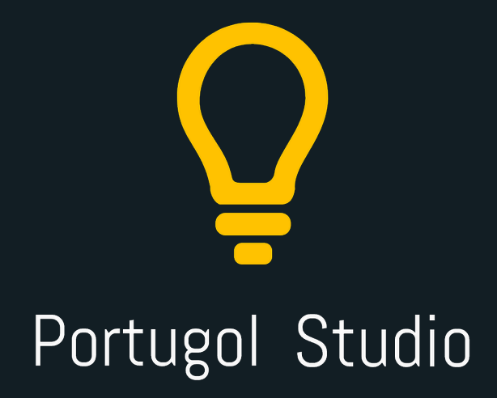
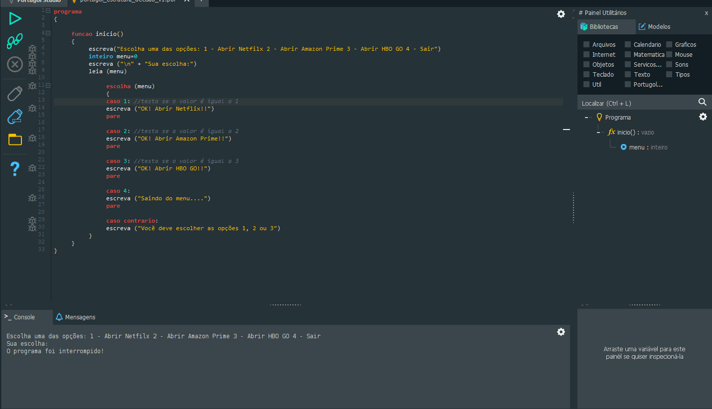

<h1 align="center">
  
</h1>

<h3 align="justify">
Application in portugol studio as an exercise in decision structure programming logic. Credits for the Essential Programming Logic module from Digital Innovation One.
</h3>

 

## 📷 Demonstration

  

 

## 🚀 Technologies

This project was developed with the following technologies:

- Portugol

 

## ⚙ Settings
- https://github.com/UNIVALI-LITE/Portugol-Studio/releases/

 

---

Made with 💜 by Rafael Maciel
